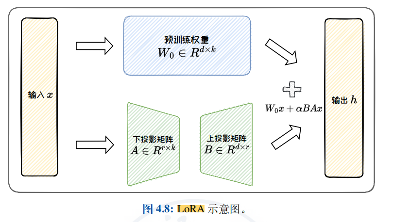
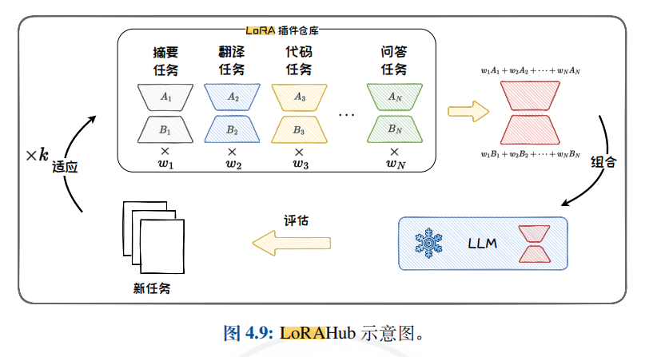
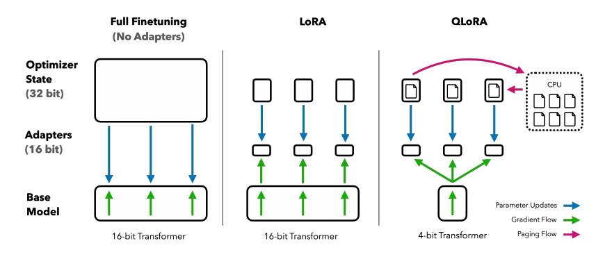
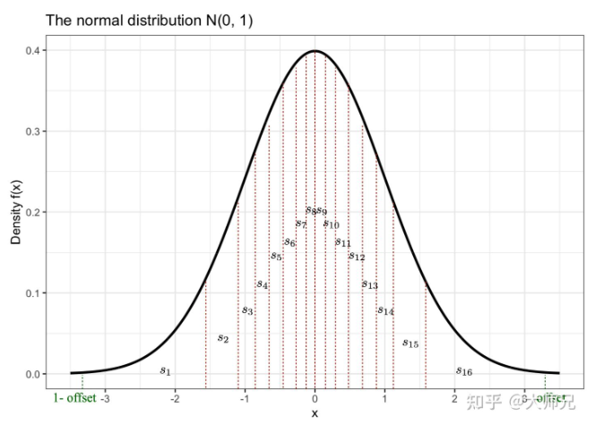

# 使用LLaMA-Factory对模型进行零代码LoRA微调

## 简介

- **项目目标**：利用开源项目 LLaMA-Factory 对开源大模型（DeepSeek-R1-Distill-Qwen-7B）进行微调，训练一个适用于特定垂直领域（这里是法律）的专用模型。
- **技术与平台**：本项目将涉及科学上网（用于访问 Hugging Face 等资源）、Conda（虚拟环境管理）、Git、Hugging Face Hub（模型与数据集）、以及 AutoDL 等云GPU平台。
- **示例环境**：
  - **云端训练环境（推荐）**：AutoDL Ubuntu Linux, RTX 4090 24GB。对于微调 7B 参数以下的模型，**单卡 24GB 显存**是常见的推荐配置。

## 理论基础

### LLaMA-Factory

LLaMA-Factory 是一个在 GitHub 上开源的**低代码/零代码大模型训练框架**，专为大型语言模型（LLMs）的微调而设计。它支持超过 100 种主流开源大模型（如 LLaMA、Baichuan、DeepSeek、Qwen 等）的多种微调方式。其核心优势在于：

- **低门槛**：提供直观的 **Web UI 界面**，极大降低了微调的操作难度，即使没有深厚编程基础的用户也能上手。
- **高效率**：集成了 **LoRA**、**QLoRA** 等先进的参数高效微调技术，能显著降低显存消耗，提升训练速度。
- **开箱即用**：内置多种预置数据集和训练模板，简化了数据准备和配置流程。
- [hiyouga/LLaMA-Factory: Unified Efficient Fine-Tuning of 100+ LLMs & VLMs (ACL 2024)](https://github.com/hiyouga/LLaMA-Factory?tab=readme-ov-file)

### LoRA、QLoRA

#### LoRA (Low-Rank Adaptation)

- **核心思想**：通过**低秩矩阵分解**来近似权重的更新过程，而非直接微调原始模型的所有参数。它向模型中的线性层注入可训练的**低秩分解矩阵**，从而极大地减少了需要训练的参数数量。
- **分类**：属于**参数高效微调**（Parameter-Efficient Fine-Tuning, PEFT）的一种方法，通常在**有监督微调**（Supervised Fine-Tuning, SFT）阶段使用。
- **适用场景**：在**数据相对充足**的情况下，对模型进行**领域适应**或**任务特定微调**，旨在保持或提升模型在特定领域的核心能力。
- **优点**：显著减少可训练参数量（通常可达原模型参数量的 1%-10%），降低计算和存储开销，且多个 LoRA 适配器可以轻量级地切换或组合。
- **论文**：[[2106.09685\] LoRA: Low-Rank Adaptation of Large Language Models](https://arxiv.org/abs/2106.09685)





#### 大模型基础（浙大毛老师著）

- GitHub链接：[ZJU-LLMs/Foundations-of-LLMs](https://github.com/ZJU-LLMs/Foundations-of-LLMs)

#### QLoRA (Quantized LoRA)

- **核心思想**：在 LoRA 的基础上，**对原始模型进行 4-bit 量化**，进一步极大减少显存占用，使得在消费级显卡上微调大模型成为可能。
- **论文**：[[2305.14314\] QLoRA: Efficient Finetuning of Quantized LLMs](https://arxiv.org/abs/2305.14314)





## 实战：准备资源

### 使用 PowerShell SSH 连接 AutoDL 服务器

#### 获取 AutoDL 服务器的连接信息

首先，您需要从 AutoDL 控制台中获取连接服务器所需的信息。

1. **登录**您的 AutoDL 账户。
2. 在您的**实例列表**中，找到目标服务器实例。
3. 进入实例管理页面，获取以下信息：
   1. SSH 登录指令**：格式通常为 `ssh -p <端口号> root@<服务器地址>`。**
   2. 登录密码**。

#### 启动 PowerShell

在您的本地 Windows 计算机上，启动 PowerShell 终端：

- 在**开始菜单**中搜索 "PowerShell" 并点击打开。
- 或者，右键点击开始按钮，选择 **"Windows PowerShell"** 或 **"终端"** (如果使用 Windows Terminal)。

#### 执行 SSH 连接命令

在 PowerShell 中，**输入或粘贴**您从 AutoDL 控制台复制的完整 SSH 登录指令，然后按回车键执行。

例如，若指令为 `ssh -p 38909 root@region-1.autodl.com`，则输入：

```bash
ssh -p 38909 root@region-1.autodl.com
```

**命令解析**：

- ssh`: 用于发起 SSH 连接的命令。
- -p <端口号>`: 指定 SSH 服务端口号（AutoDL 实例通常使用非默认端口）。
- root@<服务器地址>`: 指定用户名 (`root`) 和服务器地址。

#### 接受主机密钥（首次连接）

首次连接某台服务器时，会显示**安全警告**，提示您验证服务器的主机密钥指纹。

```bash
The authenticity of host '[region-1.autodl.com]:38909 ([::1]:38909)' can't be established.
ECDSA key fingerprint is SHA256:xxxxxxxxxxxxxxxxxxxxxxxxxxxxxxxxxxxxxxxxxxx.
Are you sure you want to continue connecting (yes/no/[fingerprint])?
```

输入 `yes`并按回车键确认，即可将服务器的主机密钥添加到本地的已知主机文件（`~/.ssh/known_hosts`）中，后续连接不再提示。

#### 输入密码

根据提示，输入从 AutoDL 控制台获取的**登录密码**，然后按回车键。

```bash
root@region-1.autodl.com's password:
```

如果密码正确，您将成功登录到远程服务器，命令提示符会变为类似 `[root@autodl-container-xxxxxxxx-xxxxxxx ~]#`的形式。现在，您可以在服务器上执行操作了。

### Conda 环境设置与项目初始化步骤

以下是搭建名为 `llamafactory_env`的 Conda 环境并进入项目目录的完整操作流程。**请按顺序执行下列命令**。

#### 创建新的 Conda 环境

首先，使用以下命令创建一个名为 `llamafactory_env`的新虚拟环境，并指定安装 Python 3.10。

```bash
conda create -n llamafactory_env python=3.10
```

**命令解析**：

- `-n llamafactory_env`: `-n`(即 `--name`) 参数后接环境名称，您可自定义。
- `python=3.10`: 指定在此新环境中安装 Python 解释器，且版本为 3.10。

#### 初始化 Conda（若尚未初始化或 Shell 未正确配置）

如果您的 Shell 此前未配置为可使用 `conda activate`命令，或在全新安装后首次使用，需要初始化 Conda 以确保后续的 `activate`命令能正常工作。

```bash
conda init
```

#### 使 Conda 初始化配置生效

`conda init`命令会修改 Shell 的配置文件（如 `~/.bashrc`）。要让更改**立即在当前 Shell 会话中生效**，请运行：

```bash
source ~/.bashrc
```

或者使用其等效简写形式：

```bash
. ~/.bashrc
```

**命令解析**：

- `source`或 `.`: 用于在当前 Shell 环境中读取并执行指定文件中的命令，此处是使刚被 `conda init`修改的 `~/.bashrc`配置文件生效。
- `~/.bashrc`: 是 Bash Shell 的用户配置文件，通常包含用户的环境变量和别名设置。

#### 激活新创建的 Conda 环境

环境创建完成后，您需要**激活**它才能使用。激活后，您的 Shell 会话将在该隔离环境中操作，后续安装的任何包都将仅限于此环境。

```bash
conda activate llamafactory_env
```

激活成功后，命令行提示符前通常会显示环境名称 `(llamafactory_env)`。

#### 进入项目目录

最后，使用 `cd`命令切换到您的项目工作目录 `autodl-fs`。

```bash
cd autodl-fs
```

此后您在此终端会话中执行的所有操作，都将在已激活的 `llamafactory_env`Conda 环境下进行。

### LLaMA-Factory 环境准备与启动

以下是搭建 LLaMA-Factory 微调环境的完整操作流程。**请按顺序执行下列命令**。

#### 创建项目目录并进入

首先，创建一个专用的项目目录并立即切换至该目录，确保所有后续操作都在此目录下进行。

```bash
mkdir -p LLM/LLaMA-Factory && cd LLM/LLaMA-Factory
```

**命令解析**：

- `mkdir -p LLM/LLaMA-Factory`: `-p`参数确保可以**一次性创建多级目录**（即 `LLM`及其子目录 `LLaMA-Factory`），如果目录已存在则不会报错。
- &&`: 逻辑"与"运算符，确保**只有前一个命令成功执行后**，后面的`cd`命令才会执行。
- `cd LLM/LLaMA-Factory`: 切换工作目录至刚创建的 `LLM/LLaMA-Factory`。

#### 克隆 LLaMA-Factory 仓库

使用 `git clone`命令获取项目代码。为了加快克隆速度并确保网络通畅，建议先设置AutoDL给的学术加速。

```bash
source /etc/network_turbo && git clone --depth 1 https://github.com/hiyouga/LLaMA-Factory.git
```

**命令解析**：

- source /etc/network_turbo：AutoDL给的学术加速
- &&: 确保代理设置成功后**才执行**克隆命令。
- `git clone --depth 1 https://github.com/hiyouga/LLaMA-Factory.git`: **浅克隆**仓库。`--depth 1`参数表示只克隆**最近的一次提交**，大大减少下载的数据量和时间。

#### 进入项目根目录

克隆完成后，需要进入项目目录进行后续操作。

```bash
cd LLaMA-Factory
```

#### 安装项目依赖

使用 `pip`安装运行 LLaMA-Factory 所需的 Python 依赖包。为了在国内获得更快的下载速度，指定清华大学镜像源。

```bash
pip install -e ".[torch,metrics]" -i https://pypi.tuna.tsinghua.edu.cn/simple
```

**命令解析**：

- `-e`: **可编辑模式**安装。这意味着对项目源码的修改会立即生效，无需重新安装包。
- `"."`: 表示安装**当前目录**下的项目（即 LLaMA-Factory 本身）。
- `[torch,metrics]`: 指定安装项目的**额外依赖组**。这通常会安装 PyTorch 框架和模型评估相关的库。
- `-i https://pypi.tuna.tsinghua.edu.cn/simple`: `-i`参数指定 pip 的**镜像源**，这里使用清华大学镜像站以加速下载。

#### 验证安装

安装完成后，通过查看版本号来验证 LLaMA-Factory 是否成功安装。

```bash
llamafactory-cli version
```

如果安装成功，此命令会输出 LLaMA-Factory 的当前版本号。

#### 启动 Web UI 界面

LLaMA-Factory 提供了一个基于 Gradio 的图形化界面（WebUI），方便用户进行模型微调和推理等操作。

```bash
llamafactory-cli webui
```

**命令解析**：

- 此命令会启动一个本地 Web 服务器，并输出访问地址（通常是 `http://127.0.0.1:7860`）。
- 执行后，终端会进入阻塞状态，持续输出日志。**请保持此终端窗口开启**。

#### 建立 SSH 端口转发（在新终端中操作）

由于 Web UI 服务运行在远程服务器的本地回环地址（`127.0.0.1`）上，要**从你的本地计算机访问**它，需要在另一个终端会话中建立 SSH 端口转发。

1. **新开一个本地终端窗口**（如 PowerShell 或 CMD）。
2. 在此新窗口中，执行以下命令（请将 `<端口号>`和 `<服务器地址>`替换为你的 AutoDL 实例信息）：

```bash
ssh -L 7860:127.0.0.1:7860 -p <端口号> root@<服务器地址>
```

**命令解析**：

- `ssh -L`: 建立**本地端口转发**。
- `7860:127.0.0.1:7860`: 将**你本地计算机的 7860 端口**映射到**远程服务器上的 127.0.0.1:7860 端口**（即 LLaMA-Factory WebUI 服务的地址）。
- `-p <端口号>`: 指定 SSH 服务的端口号（从 AutoDL 控制台获取）。
- `root@<服务器地址>`: 你的服务器登录信息。

3. 保持这个 SSH 连接窗口开启。

#### 访问 Web UI

完成端口转发后，即可在你**本地计算机的浏览器**中访问以下地址来使用 LLaMA-Factory 的图形化界面：

```bash
http://localhost:7860
```

### Hugging Face 模型下载与环境配置

以下是配置 Hugging Face 环境并下载特定模型的完整操作流程。**请按顺序执行下列命令**。

#### 创建模型存储目录并进入

首先，创建一个专用于存放 Hugging Face 模型的目录结构，并立即切换至该目录。

```bash
mkdir -p ~/autodl-fs/LLM/Hugging-Face && cd ~/autodl-fs/LLM/Hugging-Face
```

**命令解析**：

- `mkdir -p ~/autodl-fs/LLM/Hugging-Face`: `-p`参数确保**一次性创建所有不存在的父级目录**（如 `autodl-fs`和 `LLM`）。
- `&&`: 逻辑"与"运算符，确保**只有前一个命令成功执行后**，后面的 `cd`命令才会执行。
- `cd ~/autodl-fs/LLM/Hugging-Face`: 切换工作目录至刚创建的 `Hugging-Face`目录。

#### 设置 Hugging Face 缓存目录

将新创建的目录设置为 Hugging Face 的默认缓存路径，并通过修改 `~/.bashrc`文件使此设置永久生效。

```bash
echo 'export HF_HOME="~/autodl-fs/LLM/Hugging-Face"' >> ~/.bashrc && source ~/.bashrc
```

**命令解析**：

- `echo 'export HF_HOME="~/autodl-fs/LLM/Hugging-Face"' >> ~/.bashrc`: 将设置 `HF_HOME`环境变量的命令**追加**到 `~/.bashrc`文件末尾。`HF_HOME`用于指定 Hugging Face 库（如 `transformers`, `datasets`等）的默认缓存目录。
- `source ~/.bashrc`: **立即重新加载** `~/.bashrc`配置文件，使 `HF_HOME`环境变量在当前终端会话中**立刻生效**。

**验证设置**：执行以下命令检查环境变量是否已正确设置：

```bash
echo $HF_HOME
```

终端应显示 `~/autodl-fs/LLM/Hugging-Face`。

#### 激活 Conda 环境并安装工具

在下载模型前，确保处于正确的 Conda 环境中，并安装 Hugging Face 官方下载工具 `huggingface_hub`。

```bash
conda activate llamafactory_env
pip install -U huggingface_hub
```

**命令解析**：

- `pip install -U huggingface_hub`: 安装或升级 (`-U`或 `--upgrade`) `huggingface_hub`Python 包。此包提供了 `huggingface-cli`命令行工具，用于从 Hugging Face Hub 下载模型和数据集。

#### 下载模型

使用 `huggingface-cli`下载指定的模型。建议结合网络加速脚本以提高下载成功率。

```bash
source /etc/network_turbo && huggingface-cli download --resume-download deepseek-ai/DeepSeek-R1-Distill-Qwen-7B
```

**命令解析**：

- `source /etc/network_turbo`: 执行 AutoDL 平台提供的脚本，**启用学术网络加速**，为访问海外资源（如 Hugging Face）提供国内代理，优化下载速度与稳定性。
- `&&`: 确保网络加速成功启用后**才执行**下载命令。
- `huggingface-cli download`: 使用 Hugging Face 官方命令行工具下载模型。
  - `--resume-download`: **支持断点续传**。如果下载因故中断，重新执行此命令可从断点继续，无需重新开始。
  - `deepseek-ai/DeepSeek-R1-Distill-Qwen-7B`: 要下载的模型在 Hugging Face Hub 上的 **Repository ID**（格式通常为 `用户名或组织名/模型名`）。

关于模型：`deepseek-ai/DeepSeek-R1-Distill-Qwen-7B` 是一个通过**知识蒸馏**技术创建的高性能模型。它以 **Qwen 的 70亿（7B）参数架构**为基础（作为学生模型），并从 DeepSeek 更强大的内部私有模型（作为教师模型）中学习知识。通过这种方式，模型在保持 7B 参数这一相对高效规模的同时，继承了教师模型的强大推理能力，使其在逻辑、代码及通用语言任务上都表现出色。

### Lawyer LLaMA 数据集下载指南

以下是下载 Lawyer LLaMA 数据集的完整操作流程。**请按顺序执行下列命令**。

#### 执行下载命令

使用以下命令从 Hugging Face Hub 下载名为 `lawyer_llama_data`的数据集：

```bash
source /etc/network_turbo && hf download Skepsun/lawyer_llama_data --repo-type=dataset
```

#### 命令解析

**第一部分：`source /etc/network_turbo`**

- 执行 AutoDL 平台提供的脚本，**启用学术网络加速**。这会设置临时的网络代理环境变量，为访问 Hugging Face 等海外资源提供高速国内代理，显著提升下载速度和稳定性。
- `source`命令用于在当前 Shell 环境中执行指定脚本文件（此处为 `/etc/network_turbo`）中的命令，使代理设置立即生效。

**第二部分：`hf download Skepsun/lawyer_llama_data --repo-type=dataset`**

- **`hf`**：Hugging Face 官方提供的现代命令行工具 (CLI)，用于与 Hugging Face Hub 交互。
- **`download`**：`hf`工具的子命令，用于下载模型、数据集或空间等资源。
- **`Skepsun/lawyer_llama_data`**：指定要下载的资源标识符（Repository ID）。
- **`--repo-type=dataset`**：**关键选项**，用于明确指定要下载的资源类型为**数据集**（dataset），而非默认的模型（model）或空间（space）。Hugging Face Hub 根据此参数访问不同的仓库地址（例如，此处会指向 `https://huggingface.co/datasets/Skepsun/lawyer_llama_data`）。

## 实战：将模型与数据集注册至 LLaMA-Factory

以下是定位已下载的模型和数据集，并将其注册到 LLaMA-Factory 中的完整操作流程。**请按顺序执行下列命令**。

### 环境准备与路径确认

首先，进入 Hugging Face 资源的集中存储目录，并确认当前路径。

```bash
cd /root/autodl-fs/LLM/Hugging-Face/hub
pwd
```

- **目的**：确保后续所有操作都在正确的基准目录下进行。`pwd`命令用于**打印当前工作目录**，验证路径是否正确。

### 定位模型快照目录

Hugging Face Hub 会为每个模型版本创建一个唯一的哈希快照目录。需要进入该快照目录以获取模型文件的实际路径。

```bash
cd models--deepseek-ai--DeepSeek-R1-Distill-Qwen-7B/snapshots/
ls -l
```

执行 `ls -l` 后，你会看到一个由一长串字母和数字组成的目录名，这就是快照目录。**每个人看到的这个名字可能都不同，请务必使用你自己的！** 例如，你可能看到 `ad9f0ae0864d7fbcd1cd905e3c6c5b069cc8b562`。

```bash
# 注意！请将下面的哈希值替换为你自己 ls -l 后看到的那串！
cd ad9f0ae0864d7fbcd1cd905e3c6c5b069cc8b562
pwd
```

1. 使用 `cd`进入特定模型的 `snapshots`目录。
2. 使用 `ls -l`(**ll** 命令的规范写法) **列出该目录下的所有快照**，确认并选择目标快照
3. 使用 `cd`进入指定的快照目录（此处以 `ad9f0ae0864d7fbcd1cd905e3c6c5b069cc8b562`为例，请根据你的 `ls -l`实际结果替换）。
4. 使用 `pwd`**获取并复制该模型快照的绝对路径**，后续在 LLaMA-Factory 配置中会用到。

### 定位数据集快照目录

同样地，需要定位到数据集的具体快照目录。

```bash
cd /root/autodl-fs/LLM/Hugging-Face/hub
cd datasets--Skepsun--lawyer_llama_data/snapshots/
ls -l
```

执行 `ls -l` 后，你会看到一个由一长串字母和数字组成的目录名，这就是快照目录。**每个人看到的这个名字可能都不同，请务必使用你自己的！** 例如，你可能看到 `10ca311982da0225c195f3f0a990db34c6b51a07`。

```bash
# 注意！请将下面的哈希值替换为你自己 ls -l 后看到的那串！
cd 10ca311982da0225c195f3f0a990db34c6b51a07
pwd
```

- **目的**：与定位模型的目的相同，最终是为了**获取数据集的绝对路径**。请根据 `ls -l`列出的实际结果替换快照哈希值。

### 复制数据集文件至 LLaMA-Factory

将数据集文件从 Hugging Face 缓存目录复制到 LLaMA-Factory 的 `data`目录下，以便框架识别和使用。

```bash
# 可选：先确认源 JSON 文件是否存在
ls -l "/root/autodl-fs/LLM/Hugging-Face/hub/datasets--Skepsun--lawyer_llama_data/snapshots/10ca311982da0225c195f3f0a990db34c6b51a07/all.json"

# 执行复制操作 (请根据你的实际路径替换源文件和目标路径)
cp "/root/autodl-fs/LLM/Hugging-Face/hub/datasets--Skepsun--lawyer_llama_data/snapshots/10ca311982da0225c195f3f0a990db34c6b51a07/all.json" "/root/autodl-fs/LLM/LLaMA-Factory/LLaMA-Factory/data/lawyer_llama.json"

# 验证复制是否成功
ls -l "/root/autodl-fs/LLM/LLaMA-Factory/LLaMA-Factory/data/lawyer_llama.json"
```

- **谨慎操作**：在复制前使用 `ls -l`确认源文件是否存在，是好习惯
- **复制文件**：使用 `cp`命令将数据集文件 (`all.json`) 复制到 LLaMA-Factory 的 data 目录，并重命名为 `lawyer_llama.json`。
- **验证结果**：复制完成后，再次使用 `ls -l`确认目标文件已成功创建。

### 检查与规范化数据集格式

进入 LLaMA-Factory 的数据目录，检查并调整数据格式以满足框架要求。

```bash
cd /root/autodl-fs/LLM/LLaMA-Factory/LLaMA-Factory/data

# 查看数据集 README 文档，了解数据格式要求
more README_zh.md

# 查看已复制的 JSON 文件内容
more lawyer_llama.json

# 使用 sed 命令进行原地替换，将文件中的 "prefix" 替换为 "system"
sed -i 's/"prefix"/"system"/g' "./lawyer_llama.json"

# 再次查看文件，确认替换是否成功
more lawyer_llama.json
```

- 阅读 `README_zh.md`了解 LLaMA-Factory 要求的数据格式。
- 使用 `more`命令**分页查看**文件内容，避免内容过长显示混乱（按**空格键**翻页，按 **q** 键退出）。
- 使用 `sed -i`命令**直接修改文件内容**，将 JSON 结构中的 `"prefix"`键名替换为 LLaMA-Factory 可能更标准或要求的 `"system"`
- 再次查看文件，确认修改无误。

### 注册数据集到 LLaMA-Factory

最后，需要修改 LLaMA-Factory 的配置文件，将新的数据集注册进去。

```bash
# 编辑 dataset_info.json 文件
vim dataset_info.json
```

**在 `vim`中的操作**：

1. 按 `i`键进入**插入模式**。
2. 参照文件中已有的格式（例如 `identity`条目），添加一个新的配置项来指向你的 `lawyer_llama.json`文件：

```bash
"lawyer_llama": {
  "file_name": "lawyer_llama.json"
},
```

3. 按 `Esc`键退出插入模式。
4. 输入 `:wq`然后按回车，**保存文件并退出** `vim`。

## 实战：模型微调

- 见视频讲解

### 调参技巧

微调大模型时，参数设置对最终效果和训练效率至关重要。下表总结了 LLaMA-Factory 中一些关键参数的含义、作用及建议配置

| 参数类别       | LLaMA-Factory 参数                                           | 核心作用与解读                                               | 建议配置策略                                                 |
| -------------- | ------------------------------------------------------------ | ------------------------------------------------------------ | ------------------------------------------------------------ |
| **基础配置**   | `finetuning_type`                                            | 选择微调方法。`lora` 在效率与效果上平衡最佳；`qlora` 进一步降低显存消耗。 | **首选 `lora`**；显存极度紧张时（如消费级显卡）选用 `qlora`。 |
| **学习率**     | `learning_rate`                                              | 控制模型参数更新的步长，是影响训练效果最关键的参数之一。过大会导致遗忘，过小则学习慢。 | LoRA 微调: **`5e-5` ~ `4e-5`**。 全参数微调: `1e-5` ~ `5e-5`。 数据集越小，学习率应越小。 |
| **训练轮数**   | `num_train_epochs`                                           | 定义整个训练数据集被学习的完整次数。通过观察验证损失 (Validation Loss) 来判断是否过拟合或欠拟合。 | 通常从 **3** 轮开始，不超过 **10** 轮。 核心是**观察验证损失**：只要其仍在下降即可继续训练。 |
| **批量大小**   | `per_device_train_batch_size` & `gradient_accumulation_steps` | 单卡批大小受显存限制。梯度累积通过时间换空间，模拟大批量训练以稳定收敛。 **有效批量大小 = 单卡批大小 × GPU数 × 梯度累积步数** | `per_device_train_batch_size` 设为显存允许的最大值 (如 1, 2, 4...)。 通过增大 `gradient_accumulation_steps` (如 4, 8, 16) 来提高有效批量大小。 |
| **截断长度**   | `cutoff_len`                                                 | 设定模型能处理的最大输入Token数，是防止因单条过长数据导致显存溢出 (OOM) 的防御性设计。 | 根据数据集文本长度的 **P95/P99** 分布设置。 短文本: 512-1024；长文本: 2048-4096。 |
| **LoRA 特定**  | `lora_rank`                                                  | **(秩)** 决定新增适配器矩阵的大小，影响模型的表达能力和可训练参数量。 | 从 **8** 或 **16** 开始尝试，常用范围 **8-64**。 对显存影响较小。 |
|                | `lora_alpha`                                                 | **(缩放因子)** LoRA 适配器权重的缩放系数，用于平衡基础模型与适配器的影响。 | 经验法则：设为 `lora_rank` 的 **2 倍**。 (例如: rank=16, alpha=32) |
|                | `lora_target`                                                | **(作用目标)** 指定 LoRA 作用于模型的哪些层。                | 常用 `q_proj,v_proj` (效果好且高效)。 若想更充分微调，可设为 `all`。 |
| **数据集设置** | `val_set_size`                                               | 从训练集中划分数据，用于监控模型泛化能力、防止过拟合。       | 小数据集(千条内): **0.1-0.2** (10%-20%)。 大数据集(万条以上): **0.05-0.1** (5%-10%)。 |
| **优化与效率** | `fp16` / `bf16`                                              | **(混合精度)** 使用半精度浮点数加速训练、降低显存占用。      | **强烈建议开启 (`True`)**。 NVIDIA A100/H100 等新架构 GPU 推荐使用 `bf16`。 |
|                | `lr_scheduler_type`                                          | **(学习率调度器)** 在训练过程中动态调整学习率。              | 推荐使用 **`cosine`** (余弦退火)，有助于模型稳定收敛。       |
|                | `max_grad_norm`                                              | **(梯度裁剪)** 防止梯度爆炸，增加训练稳定性。                | 通常设置为 **`1.0`**。                                       |

- 推荐课程：[【5-1】调整微调参数 - 入门理解_哔哩哔哩_bilibili](https://www.bilibili.com/video/BV1djgRzxEts?spm_id_from=333.788.videopod.sections&vd_source=02e76677f89d3e6e8d65be2da8de423a&p=17)

> 【5-1】到【5-7】
