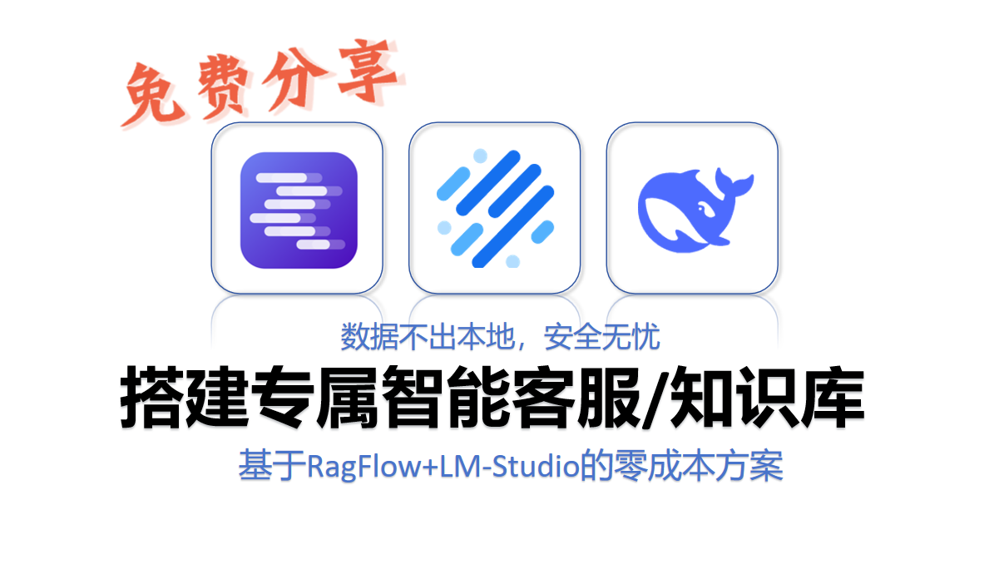

# RagFlow + LMStudio 本地知识库系列教程

本合集教你搭建本地私有知识库和智能客服系统，包含系列实战教程。



- 视频地址：[使用RagFlow和LM-Stdio搭建本地知识库和智能客服_哔哩哔哩_bilibili](https://www.bilibili.com/video/BV1n2iQBzEHn/?spm_id_from=333.1387.upload.video_card.click&vd_source=02e76677f89d3e6e8d65be2da8de423a)

## 系列教程

| 序号 | 标题 | 说明 |
|:----:|------|------|
| 1 | [实战教程1：使用 RagFlow 和 LM-Stdio 搭建本地知识库和智能客服](./实战教程1：使用%20RagFlow%20和%20LM-Stdio%20搭建本地知识库和智能客服.md) | 基础环境部署与知识库搭建 |
| 2 | [实战教程2：为 LM Studio 接入 SearXNG 本地联网搜索（基于 MCP 协议）](./实战教程2：为%20LM%20Studio%20接入%20SearXNG%20本地联网搜索%20(基于%20MCP%20协议).md) | 接入 SearXNG 实现本地联网搜索 |
| 3 | [实战教程3：通过 Tailscale 配置虚拟局域网，并在手机上远程调用本地大模型](./实战教程3：通过%20Tailscale%20配置虚拟局域网，并在手机上远程调用本地大模型.md) | 配置 Tailscale 虚拟局域网实现远程访问 |
| 4 | [实战教程4：使用 Xinference 部署并配置 Reranker 重排序模型](./实战教程4：使用%20Xinference%20部署并配置%20Reranker%20重排序模型.md) | 部署 Reranker 提升检索排序效果 |
| 5 | [实战教程5：解决 Windows 环境下沙箱组件的兼容性问题](./实战教程5：解决%20Windows%20环境下沙箱组件的兼容性问题.md) | Windows 环境兼容性问题解决方案 |

## 教程详情

### 教程1：RagFlow + LM-Stdio 搭建本地知识库和智能客服

**介绍**：本教程是整个系列的入门篇，从零开始教你部署 RagFlow 开源知识库系统，并配置 LM-Stdio 作为本地推理引擎。你将学会如何上传文档、配置 Embedding 模型、构建检索流程，最终实现一个可投入使用的本地私有知识库和智能客服系统。

**适用场景**：
- 首次搭建本地知识库，希望数据完全私有化
- 需要在离线环境中部署 RAG 系统
- 希望整合私有文档、企业内部资料进行智能问答

---

### 教程2：为 LM Studio 接入 SearXNG 本地联网搜索（基于 MCP 协议）

**介绍**：本教程教你通过 Model Context Protocol（MCP）协议，将开源搜索引擎 SearXNG 接入 LM Studio，让本地大模型拥有实时互联网搜索能力。SearXNG 作为元搜索引擎可在本地运行，隐私友好且无 API 费用限制。MCP 协议实现了标准化的工具调用，使大模型能够动态调用外部搜索能力。

**适用场景**：
- 需要大模型回答时效性问题（如最新新闻、技术文档）
- 希望在不泄露隐私的情况下使用搜索引擎
- 需要减少大模型"幻觉"，通过实时检索增强答案准确性

---

### 教程3：通过 Tailscale 配置虚拟局域网，并在手机上远程调用本地大模型

**介绍**：本教程利用 Tailscale 构建加密虚拟局域网，实现手机远程访问本地部署的大模型。Tailscale 基于 WireGuard 协议，无需复杂配置即可穿透内网。你将在手机端配置 Chatbox 等客户端，通过 API 接口调用电脑端的 LM Studio 模型，实现真正的移动办公场景。

**适用场景**：
- 需要在外出的手机上测试本地模型效果
- 希望在移动设备上使用本地模型的强大能力
- 团队成员需要远程共享使用本地 GPU 服务器

---

### 教程4：使用 Xinference 部署并配置 Reranker 重排序模型

**介绍**：本教程详细讲解如何通过 Xinference 在本地部署 Reranker（重排序）模型，并将其接入 RagFlow。Reranker 是提升 RAG 检索准确率的关键组件，它在初步向量检索后对结果进行精细排序，有效解决"搜得到但排不准"的问题。教程还包含详细的模型下载、目录规整、Docker 部署步骤。

**适用场景**：
- 知识库检索结果不准确，需要优化排序效果
- 文档量大、语义复杂的专业领域（如法律、医学）
- 希望在保持本地部署的前提下提升问答质量

---

### 教程5：解决 Windows 环境下沙箱组件的兼容性问题

**介绍**：本教程针对 Windows（Docker Desktop/WSL2）环境下 RAGFlow 沙箱执行器的兼容性问题提供完整解决方案。问题表现为 Python 插件无法使用、代码执行功能报 `unknown runtime name: runsc` 错误。教程采用"文件挂载覆盖"策略，无需重新构建镜像即可修复，降低操作风险。

**适用场景**：
- Windows 用户遇到 RAGFlow 沙箱功能不可用
- 需要在 RAGFlow 中使用 Python 代码执行、插件扩展
- Docker 容器频繁超时、初始化失败

---

## 目录结构

```
第1合集/260108-RagFlow+LMStudio-本地知识库/
├── README.md
├── resources/
│   ├── code/
│   ├── docs/
│   └── images/
├── 实战教程1：使用 RagFlow 和 LM-Stdio 搭建本地知识库和智能客服.md
├── 实战教程2：为 LM Studio 接入 SearXNG 本地联网搜索 (基于 MCP 协议).md
├── 实战教程3：通过 Tailscale 配置虚拟局域网，并在手机上远程调用本地大模型.md
├── 实战教程4：使用 Xinference 部署并配置 Reranker 重排序模型.md
└── 实战教程5：解决 Windows 环境下沙箱组件的兼容性问题.md
```

## 使用顺序

建议按顺序学习：
1. 先完成教程1搭建基础环境
2. 教程2增强搜索能力（可选，如需联网搜索）
3. 教程3实现远程访问（可选，如需移动端使用）
4. 教程4优化检索质量（可选，如需提升准确率）
5. 教程5解决 Windows 兼容问题（仅限 Windows 用户）
